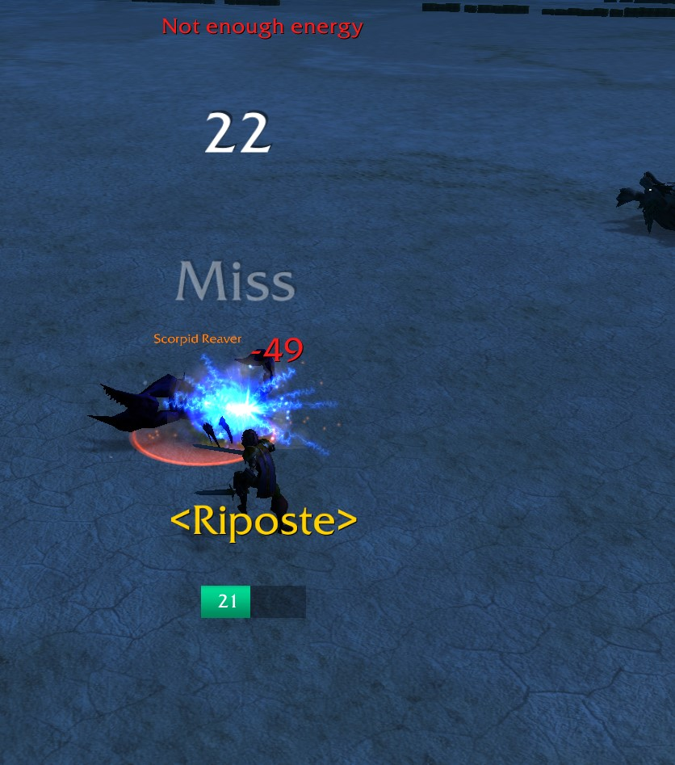

# Pulse


> Pulse aims to give a visual interpretation of when the next resources tick happens. This can be used by multiple classes but the most prominent one might be rogue and his energy regeneration.


## Providers

[](https://www.curseforge.com/wow/addons/pulse)
[](https://addons.wago.io/addons/pulse)

**WoW Burning Crusade Classic Support**

> This Addon supports WoW Burning Crusade Classic see - [bcc-Pulse](https://github.com/RagedUnicorn/wow-bcc-pulse/)

<a href="https://github.com/RagedUnicorn/wow-bcc-pulse/"></img></a>

## Installation

WoW-Addons are installed directly into your WoW directory:

`[WoW-installation-directory]\Interface\AddOns`

Make sure to get the newest version of the Addon from the releases tab:

[Pulse-Releases](https://github.com/RagedUnicorn/wow-classic-pulse/releases)

> Note: If the Addon is not showing up in your ingame Addonlist make sure that the Addon is named `Pulse` in your Addons folder

## What is Pulse?

Pulse is a simple addon that tracks the energy-regen tickrate and the current amount of energy. The energybar will show once the player spent some energy.



## FAQ

#### The Addon is not showing up in WoW. What can I do?

Make sure to recheck the installation part of this Readme and check that the Addon is placed inside `[WoW-installation-directory]\Interface\AddOns` and is correctly named as `Pulse`.

#### The Addon is spamming my chat with messages. Why is it doing this?

Chances are you downloaded a development version of the addon. If you directly download the master branch you will get a development version that is printing a lot of debug message to the chat. Make sure that you download a release version of the addon here - [Pulse-Releases](https://github.com/RagedUnicorn/wow-classic-pulse/releases)

#### I get a red error (Lua Error) on my screen. What is this?

This is what we call a Lua error, and it usually happens because of an oversight or error by the developer (in this case me). Take a screenshot off the error and create a GitHub Issue with it, and I will see if I can resolve it. It also helps if you can add any additional information of what you were doing at the time and what other addons you have active. Additionally, if you are able to reproduce the error make sure to check if it still happens if you disable all others addons.

## Development

### Switching between Environments

Switching between development and release can be achieved with maven.

```
mvn generate-resources -D generate.sources.overwrite=true -P development
```

This generates and overwrites `P_Environment.lua` and `Pulse.toc`. You need to specifically specify that you want to overwrite the files to prevent data loss. It is also possible to omit the profile because development is the default profile that will be used.

Switching to release can be done as such:

```
mvn generate-resources -D generate.sources.overwrite=true -P release
```

In this case it is mandatory to add the release profile.

**Note:** Switching environments has the effect changing certain files to match an expected value depending on the environment. To be more specific this means that as an example test and debug files are not included when switching to release. It also means that variables such as loglevel change to match the environment.

As to not change those files all the time the repository should always stay in the development environment. Do not commit `Pulse.toc` and `P_Environment.lua` in their release state. Changes to those files should always be done inside `build-resources` and their respective template files marked with `.tpl`.

### Packaging the Addon

To package the addon use the `package` phase.

```
mvn package -D generate.sources.overwrite=true -P development
```

This generates an addon package for development. For generating a release package the release profile can be used.

```
mvn package -D generate.sources.overwrite=true -P release
```

**Note:** This packaging and switching resources can also be done one after another.

**Note:** The packaging is not fit to be used for CurseForge because CurseForge expects a specific packaging

```
# switch environment to release
mvn generate-resources -D generate.sources.overwrite=true -P release
# package release
mvn package -P release
```

### Deploy GitHub Release

Before creating a new release update `addon.tag.version` in `pom.xml`. Afterwards to create a new release and deploy to GitHub the `deploy-github` profile has to be used.

```
# switch environment to release
mvn generate-resources -D generate.sources.overwrite=true -P release
# deploy release to GitHub
mvn package -P deploy-github -D github.auth-token=[token]
```

**Note:** This is only intended for manual deployment to GitHub. With GitHub actions the token is supplied as a secret to the build process

### Deploy CurseForge Release

**Note:** It's best to create the release for GitHub first and only afterwards the CurseForge release. That way the tag was already created.

```
# switch environment to release
mvn generate-resources -D generate.sources.overwrite=true -P release
# deploy release
mvn package -P deploy-curseforge -D curseforge.auth-token=[token]
```

**Note:** This is only intended for manual deployment to CurseForge. With GitHub actions the token is supplied as a secret to the build process

### Deploy Wago.io Release

**Note:** It's best to create the release for GitHub first and only afterwards the Wago.io release. That way the tag was already created.

```
# switch environment to release
mvn generate-resources -D generate.sources.overwrite=true -P release
# deploy release
mvn package -P deploy-wago -D wago.auth-token=[token]
```

**Note:** This is only intended for manual deployment to Wago.io. With GitHub actions the token is supplied as a secret to the build process

### GitHub Action Profiles

This project has GitHub action profiles for different Devops related work such as linting and deployments to different providers. See `.github` folder for details.

## License

MIT License

Copyright (c) 2023 Michael Wiesendanger

Permission is hereby granted, free of charge, to any person obtaining
a copy of this software and associated documentation files (the
"Software"), to deal in the Software without restriction, including
without limitation the rights to use, copy, modify, merge, publish,
distribute, sublicense, and/or sell copies of the Software, and to
permit persons to whom the Software is furnished to do so, subject to
the following conditions:

The above copyright notice and this permission notice shall be
included in all copies or substantial portions of the Software.

THE SOFTWARE IS PROVIDED "AS IS", WITHOUT WARRANTY OF ANY KIND,
EXPRESS OR IMPLIED, INCLUDING BUT NOT LIMITED TO THE WARRANTIES OF
MERCHANTABILITY, FITNESS FOR A PARTICULAR PURPOSE AND
NONINFRINGEMENT. IN NO EVENT SHALL THE AUTHORS OR COPYRIGHT HOLDERS BE
LIABLE FOR ANY CLAIM, DAMAGES OR OTHER LIABILITY, WHETHER IN AN ACTION
OF CONTRACT, TORT OR OTHERWISE, ARISING FROM, OUT OF OR IN CONNECTION
WITH THE SOFTWARE OR THE USE OR OTHER DEALINGS IN THE SOFTWARE.
