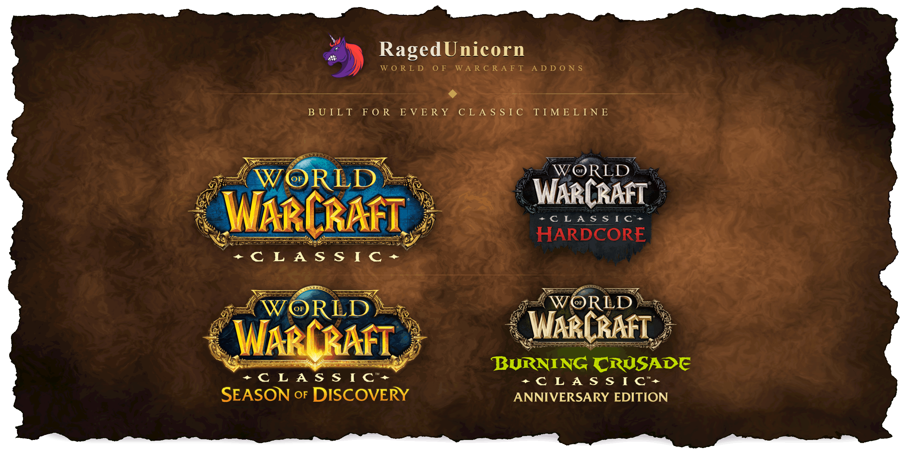
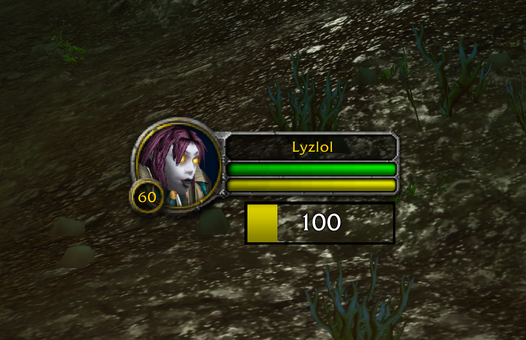
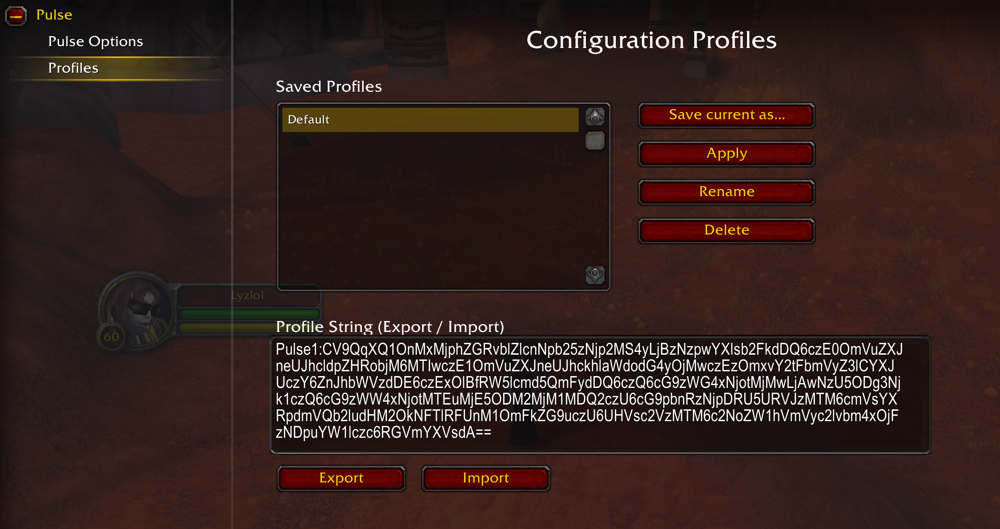

# Pulse

> Pulse gives a visual interpretation of when the player's next energy tick happens, letting energy users such as rogues time their actions around the 2-second energy-regen tick.

## Providers

## Installation

WoW-Addons are installed directly into your WoW directory:

`[WoW-installation-directory]\Interface\AddOns`

Make sure to get the newest version of the Addon from the releases tab:

[Pulse-Releases](https://github.com/RagedUnicorn/wow-classic-pulse/releases)

> Note: If the Addon is not showing up in your ingame Addonlist make sure that the Addon is named `Pulse` in your Addons folder

## What is Pulse?

Pulse is a simple addon that tracks the energy-regen tickrate and the current amount of energy. The energybar will show once the player spent some energy.

The bar keeps sweeping even while energy is full. This is intentional and one of the main use cases of the addon: it lets you time an attack right before the next energy tick. A rogue sitting at full energy in stealth, for example, can watch the bar and open just before a tick, so the first energy regenerates shortly after the opener.

## Configuration

Pulse can be configured through the in-game interface options. Access the configuration by:

1. Opening the game menu (ESC key)
2. Selecting "Options"
3. Navigating to "AddOns"
4. Finding "Pulse Options" in the list

Alternatively, you can use the slash command: `/pulse opt` or `/rgp opt`

### Available Settings

#### Energy Bar Positioning
- **Lock Energy Bar**: When enabled, prevents the energy bar from being moved by dragging. When disabled, you can drag the energy bar to reposition it anywhere on your screen.

#### Energy Bar Dimensions
- **Energy Bar Width**: Adjust the width of the energy bar to fit your UI layout. Use the slider to increase or decrease the horizontal size.
- **Energy Bar Height**: Adjust the height of the energy bar. Use the slider to increase or decrease the vertical size.

### Profiles

Pulse lets you save your configuration as named profiles, so you can switch between different setups or carry your settings to another character. Profiles are managed under the **Profiles** tab of the configuration interface.

A profile captures all of your Pulse settings – the energy bar lock state, its width and height, and its on-screen position.

- **Save current as...**: Snapshots your current settings into a new named profile (or overwrites an existing one of the same name).
- **Apply**: Loads the selected profile and applies its settings.
- **Rename**: Renames the selected profile.
- **Delete**: Removes the selected profile.

#### Sharing Profiles (Export / Import)

Profiles can be shared as portable strings, making it easy to copy a setup between characters or hand it to another player.

- **Export**: Generates a copy-pasteable profile string for the selected profile in the *Profile String* field.
- **Import**: Paste a profile string into the field and import it as a new profile. Imported strings are validated, so an invalid, corrupted, or non-Pulse string is rejected without changing any of your settings.

> Note: Profiles are stored per character. Use export/import to move a profile to another character.

## FAQ

#### The Addon is not showing up in WoW. What can I do?

Make sure to recheck the installation part of this Readme and check that the Addon is placed inside `[WoW-installation-directory]\Interface\AddOns` and is correctly named as `Pulse`.

#### The Addon is spamming my chat with messages. Why is it doing this?

Chances are you downloaded a development version of the addon. If you directly download the master branch you will get a development version that is printing a lot of debug message to the chat. Make sure that you download a release version of the addon here - [Pulse-Releases](https://github.com/RagedUnicorn/wow-classic-pulse/releases)

#### I get a red error (Lua Error) on my screen. What is this?

This is what we call a Lua error, and it usually happens because of an oversight or error by the developer (in this case me). Take a screenshot off the error and create a GitHub Issue with it, and I will see if I can resolve it. It also helps if you can add any additional information of what you were doing at the time and what other addons you have active. Additionally, if you are able to reproduce the error make sure to check if it still happens if you disable all others addons.

## Development

For detailed development documentation including:
- Environment setup and switching
- Debugging and log filtering
- Code style guidelines
- Building and packaging
- Deployment procedures
- Common development tasks

See [DEVELOPMENT.md](DEVELOPMENT.md).

## License

MIT License

Copyright (c) 2026 Michael Wiesendanger

Permission is hereby granted, free of charge, to any person obtaining
a copy of this software and associated documentation files (the
"Software"), to deal in the Software without restriction, including
without limitation the rights to use, copy, modify, merge, publish,
distribute, sublicense, and/or sell copies of the Software, and to
permit persons to whom the Software is furnished to do so, subject to
the following conditions:

The above copyright notice and this permission notice shall be
included in all copies or substantial portions of the Software.

THE SOFTWARE IS PROVIDED "AS IS", WITHOUT WARRANTY OF ANY KIND,
EXPRESS OR IMPLIED, INCLUDING BUT NOT LIMITED TO THE WARRANTIES OF
MERCHANTABILITY, FITNESS FOR A PARTICULAR PURPOSE AND
NONINFRINGEMENT. IN NO EVENT SHALL THE AUTHORS OR COPYRIGHT HOLDERS BE
LIABLE FOR ANY CLAIM, DAMAGES OR OTHER LIABILITY, WHETHER IN AN ACTION
OF CONTRACT, TORT OR OTHERWISE, ARISING FROM, OUT OF OR IN CONNECTION
WITH THE SOFTWARE OR THE USE OR OTHER DEALINGS IN THE SOFTWARE.
